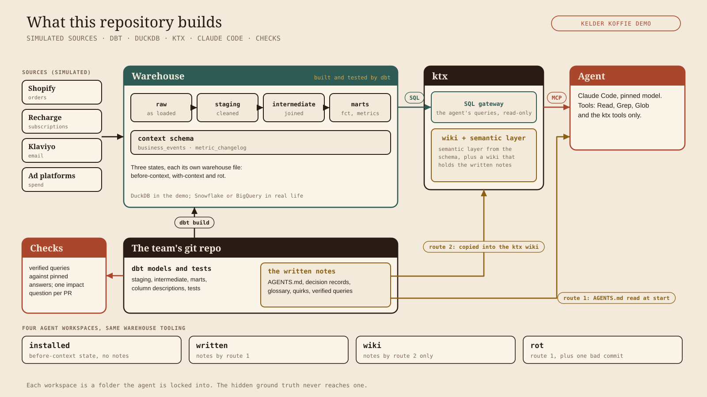

# Kelder Koffie: a data context layer you can run

The demo behind **Building a data context layer to fix your AI analytics**, a talk by Thomas in't Veld
(Tasman Analytics) at Compass AI & Tech Summit, Budapest, 1 October 2026.



## What this is

Kelder Koffie is a fictional coffee subscription company in Amsterdam. It is fictional on purpose. We
generated every customer and every subscription, so we know the right answer to every question.

Its warehouse is well built and fully documented. But on 12 March 2026 billing moved from Shopify to
Recharge, and the import wrote 1,903 paused subscriptions as cancelled. March churn reads 9.4%. The
real figure is 3.3%. Nothing in the tables says so.

We asked an AI agent the same questions in four set-ups and kept every run.

## What we found

1. **An agent can find what looks odd. It cannot know why.** With no notes, the agent found the
   batch of cancellations on 12 March every time. It never gave the board the right number (0 of 5
   runs).
2. **Writing the reasons down fixes it, wherever they live.** With the notes in the repo, 3 of 3 runs
   gave 3.3%. With the same notes only in the ktx wiki, 2 of 2.
3. **Written notes go stale.** One ordinary commit, "Fix churn logic", flips a year-on-year comparison
   from better to worse. Every note and every dbt test still agree with the old answer. A pinned
   answer in CI catches it. So did the agent, which read the SQL (3 of 3 runs, our reading of the
   transcripts). A dashboard would not have.

These are small samples: 69 runs on `claude-opus-5-5`, about $12 in all. The results by question are in
[`demo/trial_summary.md`](demo/trial_summary.md), and our reading of every run is in
[`demo/labels/labels.csv`](demo/labels/labels.csv).

Open [`index.html`](index.html) for the charts and diagrams, arranged by the talk's three tenets.

## Run it

You need macOS, [uv](https://docs.astral.sh/uv/), git, and Node.js 18 or newer. Nothing is installed
globally.

```bash
make setup     # Python environment, plus pinned Claude Code and ktx in ~/kelder-demo/_tools
make all       # generate the data, build the three warehouse states, run the tests, draw the charts (about 3 minutes)
make demo      # create the four agent workspaces in ~/kelder-demo, start ktx, run the leak check
make doctor    # check everything and print the next step
```

Then try the checks CI runs on the bad commit. They fail on purpose:

```bash
make check STATE=rot PR_BODY=kelder-dbt/.pr/rot.md
```

Agent runs need an `ANTHROPIC_API_KEY` in `.env` (copy `.env.example`). A run costs about $0.10 to $0.30.

```bash
scripts/demo_terminal.sh agent installed    # ask a question with no notes
scripts/demo_terminal.sh agent written      # the same question with notes in the repo
make trials WORKSPACE=wiki N=3              # recorded runs, then: make summary
```

A good first question: *What was subscriber churn in March 2026? I need one number for the board deck.*

## The four workspaces

Each workspace is a folder the agent is locked into. It holds Kelder's dbt repo at one state and a copy
of that state's warehouse. The agent reaches the warehouse only through ktx.

| Workspace | What the agent has |
|---|---|
| `installed` | The warehouse before anyone wrote the context down. |
| `written` | The notes in the repo. `AGENTS.md` loads when the session starts. |
| `wiki` | The same notes, but only in the ktx wiki. |
| `rot` | Like `written`, plus the bad commit. |

## Kelder's repo in three states

`kelder-dbt/` is a normal dbt project. Its history reads as Kelder's own, and each state is a git tag.

| State | Tag | What it is |
|---|---|---|
| before-context | `kelder/before-context` | Competent and documented, with no context layer. |
| with-context | `kelder/with-context` | Adds column caveats, a business events table, a metric changelog, decision records, a glossary, verified queries, `AGENTS.md` and one question in the pull request template. |
| rot | `kelder/rot` | One commit on top of with-context that breaks the restated churn series. The notes stay the same. |

## What is where

| Path | Contents |
|---|---|
| `generator/` | Simulates Kelder from 2023 to 2026, through Shopify, Recharge, Klaviyo and the ad platforms. Deterministic from one seed; no language model. |
| `kelder-dbt/` | Kelder's dbt project, in three states. |
| `scripts/` | Builds the states and workspaces, runs ktx, the checks and the trials. |
| `tests/` | Calibration, realism, ground truth and the leak check. |
| `demo/` | The questions, the trial summary and labels, and the stored ktx ingest output. |
| `charts/` | The charts and diagrams, and the code that draws them. |
| `index.html` | The evidence page. |

## Keeping it honest

- The ground truth, the generator and the pinned answers never reach a workspace. `make leak-check` proves it.
- The agent can read files and use ktx. It cannot run a shell, search the web or write anything. Its SQL is read-only.
- Every run is kept. Nothing was re-run or tuned to get a better result.
- The full transcripts stay on the machine that ran them (`demo/runs/` is not committed). The summary and our reading of each run are.
- ktx builds its wiki and semantic layer with a language model. That output is stored once per state, in `demo/ktx/`, and never regenerated.

## Read more

- [How to Build a Context Layer (Because You Cannot Buy One)](https://www.tasman.ai/news/how-to-build-a-context-layer): the article Kelder comes from.
- [Addressing Data Model Creep with Domain Modeling](https://www.tasman.ai/news/domain-modelling-howto): the domain model in part 3 of the talk.
- [`BUILD_LOG.md`](BUILD_LOG.md): every decision made while building this, in order.
