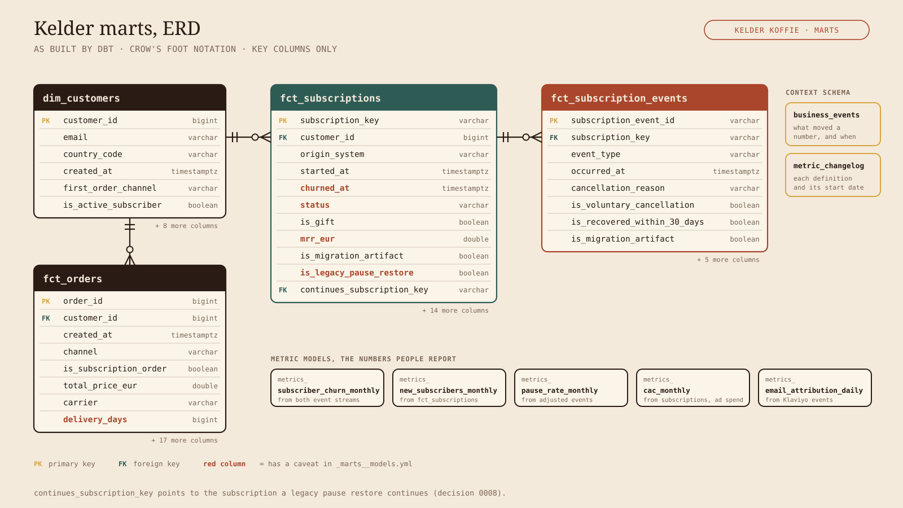
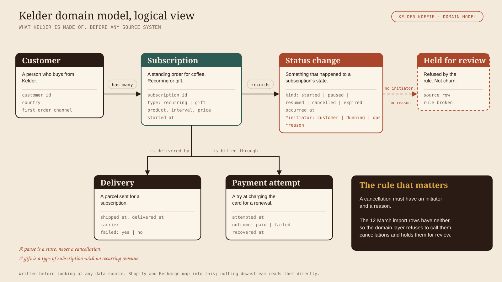
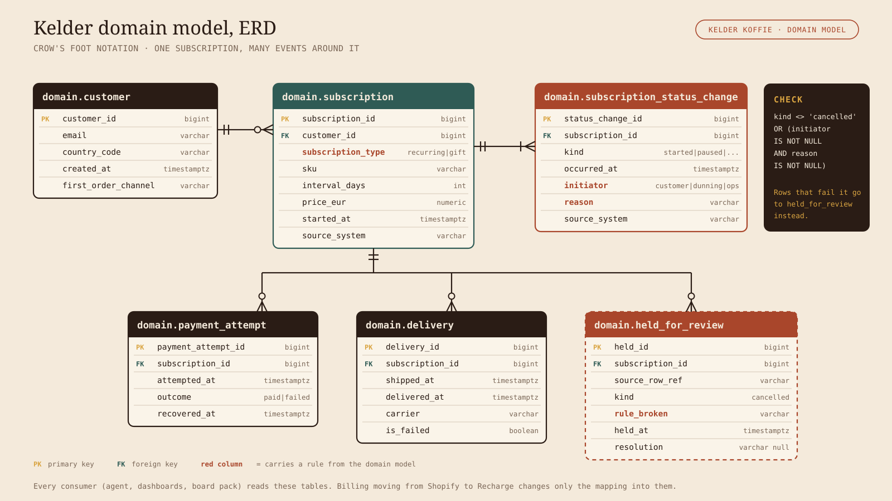

# Docs

## The marts today

The four core marts and how they join. Only the key columns are drawn. Columns in red carry a
caveat in `models/marts/_marts__models.yml`; read it before reporting from them. The `metrics_*`
models are the numbers we report.

## Proposed domain model

Not implemented. A proposal for where we want to take the project.

Today the marts follow the source systems, so the warehouse accepts whatever Recharge calls a
cancellation. The domain model describes what Kelder is made of first: customers, subscriptions,
status changes, deliveries and payment attempts. Sources map into it once, and everything
downstream reads only from it.

The rule that matters: a cancellation needs an initiator (the customer, dunning or ops) and a
reason. Rows without both are held for review instead of counted as churn. The 12 March import
rows would have been caught here (see decision 0007).

